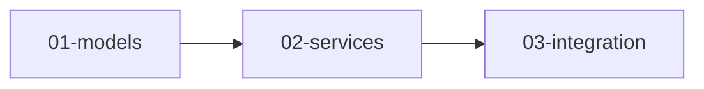

# Plan: Design → Documentation-First Implementation Plan

**Philosophy:** Plans are permanent documentation, not throwaway artifacts. They explain WHAT to build and WHY, not HOW to write the code. Agents are trusted to implement from intent by reading codebase patterns.

## Core Principles

1. **No source code** - Plans contain intent, pseudocode, diagrams
2. **Hierarchical structure** - Overview for high-level review, sub-plans for focused detail
3. **Permanent documentation** - Plans explain rationale for future developers
4. **Human context management** - Reviewable in layers, not one massive file
5. **Agent context management** - Sub-plans loadable independently

---

## Trigger Conditions

Run this skill when:
- Design has been approved (`/brainstorm` completed)
- User says "write the plan", "plan this", "create plan for..."
- A design document exists at `${PROJECT_ROOT}/docs/designs/{feature}/design.md`

## Prerequisites

**Step 0: Resolve Project Root:**

**CRITICAL:** All documentation must be created in the project root `docs/` folder, not in subdirectories like `tools/*/docs/`.

```bash
# Resolve project root (works in worktrees too)
PROJECT_ROOT=$(git rev-parse --show-toplevel)
echo "Project root: ${PROJECT_ROOT}"

# Verify docs folder exists at project root
ls "${PROJECT_ROOT}/docs/"
```

All subsequent paths in this skill use `${PROJECT_ROOT}/docs/` to ensure documentation lands in the correct location regardless of current working directory.

**Verify before starting:**
- [ ] PROJECT_ROOT resolved correctly (shows project root path)
- [ ] Design document exists at `${PROJECT_ROOT}/docs/designs/{feature}/design.md`
- [ ] Design has been approved by user
- [ ] If no design doc, run `/brainstorm` first

---

## Output Structure

```
${PROJECT_ROOT}/docs/plans/{feature}/
├── overview.md           # High-level breakdown (~100-150 lines)
├── 01-{component}.md     # Sub-plan for first component (~50-80 lines)
├── 02-{component}.md     # Sub-plan for second component
├── ...
└── diagrams/             # Visual documentation
    ├── {name}.md         # Mermaid diagrams
    └── ...
```

**IMPORTANT:** Always use the `${PROJECT_ROOT}` variable resolved in Prerequisites to ensure plans are created in the project root, not in subdirectories.

---

## Critical Sequence

### Phase 1: Load Design Context

**Step 1.1 - Find Design Document:**
```bash
ls "${PROJECT_ROOT}/docs/designs/{feature}/design.md"
```

**Step 1.2 - Extract from Design:**
- Goal and problem statement
- Chosen approach and rationale
- Components identified (from Work Decomposition Preview)
- Success/failure criteria
- Architectural decisions
- Boundaries (in scope, out of scope, anti-requirements)
- Learnings applied (these inform plan structure)

**Step 1.3 - Use Work Decomposition Preview:**

The design's Work Decomposition Preview directly informs plan structure:

| Design Section | Maps To |
|----------------|---------|
| Logical Components | Sub-plans (one per component) |
| Context Considerations | Bead sizing guidance |
| Suggested Execution Order | Dependency structure |

**Step 1.4 - Verify Readiness:**
```
[ ] Design document is complete
[ ] Work Decomposition Preview exists
[ ] No critical open questions
[ ] Components are identified
[ ] Boundaries are clear
```

If not ready, suggest running `/brainstorm` first.

---

### Phase 2: Task Decomposition

**Step 2.1 - Identify Logical Components:**
Break the feature into logical work areas:
- Model changes (data structures)
- Service logic (business rules)
- Integration (wiring components)
- UI changes (if applicable)
- Configuration (data files)

**Step 2.2 - Map Tasks to Components:**
Each component becomes a sub-plan. Tasks within a component are steps in that sub-plan.

**Step 2.3 - Identify Dependencies:**
Which components must complete before others?

---

### Phase 3: Write Overview Plan

Create `${PROJECT_ROOT}/docs/plans/{feature}/overview.md`:

```markdown
# Plan: {Feature Name}

> Implementation plan for {feature}. See [design document](../../designs/{feature}/design.md) for problem statement and architectural decisions.

## Summary

{2-3 sentences: what this plan achieves}

## Architecture Overview

{Brief description of how components fit together. Reference design doc for detailed rationale.}

## Task Breakdown

| # | Component | Sub-Plan | Description |
|---|-----------|----------|-------------|
| 1 | {name} | [01-{name}.md](01-{name}.md) | {brief description} |
| 2 | {name} | [02-{name}.md](02-{name}.md) | {brief description} |
| ... | ... | ... | ... |

## Dependencies



## Success Criteria

- {Observable outcome from design}
- {Observable outcome from design}

## Verification

- [ ] All unit tests pass
- [ ] Integration tests pass
- [ ] {Manual verification step}

## References

- Design: [design.md](../../designs/{feature}/design.md)
- Related docs: {list relevant reference docs}

---
*Plan created: {date}*
*Components: {N} sub-plans*
```

---

### Phase 4: Write Sub-Plans

For each component, create `${PROJECT_ROOT}/docs/plans/{feature}/NN-{component}.md`:

```markdown
# Sub-Plan: {Component Name}

> Part of [{Feature} Plan](overview.md)

## Objective

{What this component achieves - 2-3 sentences}

## Context

{How this component fits into the larger feature. What it depends on, what depends on it.}

## Tasks

### Task 1: {Name}

**Objective:** {What to achieve}

**Approach:**
{Description in plain language of what needs to happen}

**Pseudocode:**
```
WHEN {trigger condition}:
  IF {condition}:
    {action}
  ELSE:
    {alternative action}

  {next step}
```

**Pattern Reference:**
- Similar to: `{path to similar existing code}`
- Follow pattern in: `{service or component name}`

**Success Criteria:**
- {Observable outcome}
- {Observable outcome}

**Failure Criteria:**
- ❌ {Anti-pattern to avoid}
- ❌ {Common mistake}

**Verification:**
- Test: {What to test}
- Manual: {How to verify manually if applicable}

---

### Task 2: {Name}
...

## Component Success Criteria

- {All tasks complete}
- {Component-level verification}

## References

- Docs: `{relevant reference docs}`
- Patterns: `{existing code to reference}`
- Learnings: `{relevant learnings entries}`
```

---

### Phase 5: Create Diagrams (When Valuable)

Create diagrams in `${PROJECT_ROOT}/docs/plans/{feature}/diagrams/` when they clarify:
- State machines
- Data flow
- Sequence of operations
- Component relationships

**Diagram Format (Mermaid in Markdown):**

```markdown
# {Diagram Name}

## Purpose
{What this diagram explains}

## Diagram

```mermaid
{diagram code}
```

## Notes
{Any clarifications}
```

**When to Include Diagrams:**
- State with multiple transitions → State diagram
- Multi-step process → Sequence diagram
- Data transformation → Flowchart
- Component relationships → Component diagram

**When NOT to Include:**
- Simple CRUD operations
- Single-step changes
- Obvious flows

---

### Phase 6: Self-Review (Minimum 2 Rounds)

**Exit criteria:** Two consecutive rounds with zero issues found.
**Typical:** 2-3 rounds total.

**Review Process for EACH Round:**
1. Clear mental context
2. Re-read design document fresh
3. Re-read all plan files fresh
4. Apply ALL review themes below
5. Fix any issues found
6. If issues found, proceed to next round
7. If no issues, check if previous round was also clean → exit

---

#### Review Themes (Apply ALL Each Round)

**Theme 1: No Source Code**
- Plans contain pseudocode, NOT implementation code
- No copy-paste code blocks
- No exact method signatures
- Intent is clear without seeing implementation

**Theme 2: Hierarchical Review**
- Overview is readable in ~2 minutes
- Sub-plans are focused on single component
- User can drill down only where needed
- Each file stands alone with context

**Theme 3: Documentation Value**
- Future developer could understand WHY
- Rationale for decisions is captured
- Trade-offs are documented
- Connects to design doc for deeper context

**Theme 4: Task Quality**
- Each task has clear objective
- Success/failure criteria are observable
- Pattern references point to real code
- Pseudocode clarifies logic without dictating syntax

**Theme 5: Agent Executability**
- Tasks can become beads
- Context references are specific
- An agent could implement from this intent
- No ambiguous requirements

**Theme 6: Completeness**
- All components from design have sub-plans
- Dependencies are mapped
- Verification steps exist
- Nothing is assumed or implicit

---

#### Review Log Format

```markdown
## Self-Review Log

### Round 1
**Issues Found:** 2
- [Source Code] Task 3 had C# code block → Converted to pseudocode
- [Completeness] Missing sub-plan for configuration → Added 04-config.md

### Round 2 (fresh read)
**Issues Found:** 1
- [Documentation] Missing rationale for approach → Added context section

### Round 3 (fresh read)
**Issues Found:** 0
- All themes pass ✅
```

**Exit criteria:** Two consecutive rounds with zero issues.

---

### Phase 7: Present to User

```markdown
## Plan Summary

**Feature:** {name}
**Overview:** `${PROJECT_ROOT}/docs/plans/{feature}/overview.md`
**Sub-Plans:** {N} component plans

### Structure

```
${PROJECT_ROOT}/docs/plans/{feature}/
├── overview.md        (~{N} lines)
├── 01-{name}.md       (~{N} lines)
├── 02-{name}.md       (~{N} lines)
├── ...
└── diagrams/
    └── {name}.md
```

### Component Overview

| # | Component | Tasks | Focus |
|---|-----------|-------|-------|
| 1 | {name} | {N} | {brief} |
| 2 | {name} | {N} | {brief} |

### Self-Review Summary

| Round | Issues | Key Fixes |
|-------|--------|-----------|
| 1 | 2 | Converted code to pseudocode, added missing sub-plan |
| 2 | 1 | Added rationale documentation |
| 3 | 0 | ✅ All themes pass |

### Review Guidance

1. **Start with:** `overview.md` for high-level understanding
2. **Drill into:** Sub-plans for components you want to verify
3. **Check diagrams:** If visual clarification helps

---

Ready for review. Options:
1. "plan approved" → Proceed to /beads
2. Request changes to specific sub-plans
3. "needs diagram" → Add visual for specific component
4. "back to design" → Revise design first
```

---

## Quality Standards

### Plan Documents
- No source code (pseudocode only)
- Hierarchical (overview + sub-plans)
- Documentation value (explains WHY)
- Specific pattern references
- Observable success criteria

### Self-Review
- Minimum 2 review rounds
- All 6 themes each round
- Issues fixed before next round
- Exit: 2 consecutive clean rounds

### Structure
- Overview: ~100-150 lines max
- Sub-plans: ~50-80 lines each
- Diagrams: only when they add clarity

---

## Anti-Patterns

❌ **Source code in plans**
```csharp
// DON'T include this
public bool KnownCursed { get; init; }
```

✅ **Pseudocode instead**
```
Add KnownCursed boolean property to Item record
Default: false
Behavior: Set true on curse discovery, cleared on uncurse
```

❌ **Monolithic plan file**
- One 1000+ line file

✅ **Hierarchical structure**
- Overview + focused sub-plans

❌ **Implementation details**
- "Use LINQ OrderBy with lambda"

✅ **Intent and pattern reference**
- "Sort casters by preference, similar to existing targeting in MonsterAIService"

---

## Exit Signals

| Signal | Meaning |
|--------|---------|
| "plan approved" | Proceed to /beads |
| "adjust plan" | Revise specific sub-plans |
| "needs diagram" | Add visual documentation |
| "back to design" | Return to /brainstorm |

When approved: **"Plan approved. Run /beads to create implementation tasks."**
