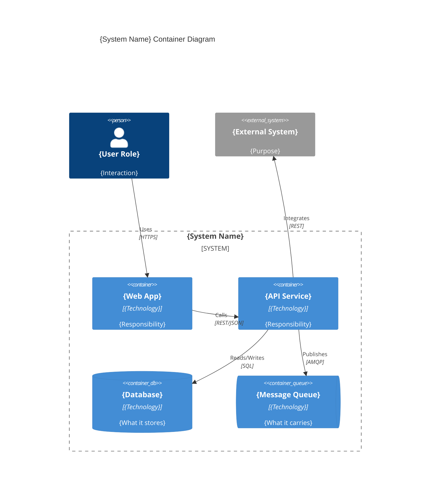

# C4 Container Diagram Template

A container diagram zooms into the **system boundary** to show the high-level technology building blocks — applications, services, databases, message queues — and how they communicate.

## Key Elements

| Element | Description | Examples |
|---------|-------------|----------|
| Container | A deployable/runnable unit | Web app, API, database, queue |
| Person | Users from the context diagram | Same as context |
| External System | Systems from the context diagram | Same as context |
| Relationship | Communication between containers | Arrow with protocol |

## Template

```markdown
# {System Name} — Container Diagram

## Overview

{1-2 sentences: what containers make up the system and how they relate.}

## Diagram



## Containers

| Container | Technology | Responsibility | Port/Protocol |
|-----------|------------|----------------|---------------|
| {Web App} | {React, Vue, etc.} | {What it does} | {443/HTTPS} |
| {API} | {Node, .NET, etc.} | {What it does} | {8080/REST} |
| {Database} | {Postgres, Mongo, etc.} | {What it stores} | {5432/SQL} |

## Communication

| From | To | Protocol | Purpose |
|------|----|----------|---------|
| {Web App} | {API} | REST/JSON | {What flows} |
| {API} | {Database} | SQL | {What's stored/queried} |
| {API} | {Queue} | AMQP | {What events flow} |

## Technology Decisions

| Decision | Choice | Rationale |
|----------|--------|-----------|
| {e.g., API framework} | {e.g., Express.js} | {Why this choice} |
| {e.g., Database} | {e.g., PostgreSQL} | {Why this choice} |
```

## Guidance
- Each container is separately deployable or runnable
- Include the technology choice for each container (language, framework, database engine)
- Label communication with protocol AND what flows ("REST/JSON: order data")
- Group containers inside a system boundary
- Keep actors and external systems from the context diagram for continuity

## Anti-Patterns
- ❌ Showing classes or code-level detail (that's a component diagram)
- ❌ Missing technology labels on containers
- ❌ Unlabeled communication arrows
- ❌ Containers without clear responsibilities
- ❌ Forgetting the system boundary grouping
