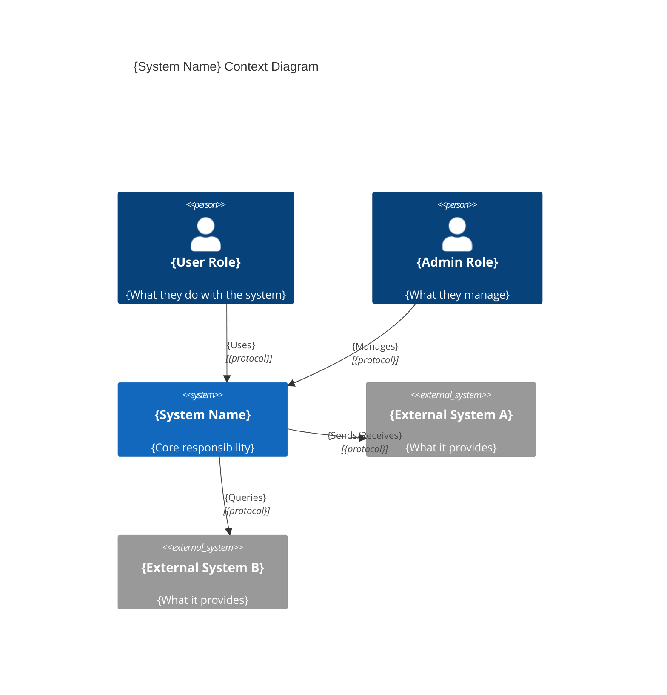

# C4 Context Diagram Template

A context diagram shows the **system boundary** — who uses the system, and what external systems it interacts with. This is the highest-level C4 view.

## Key Elements

| Element | Description | Notation |
|---------|-------------|----------|
| System | The system being documented | Box (highlighted) |
| Person | Human users or roles | Stick figure or box |
| External System | Systems outside your control | Box (dimmed) |
| Relationship | Data flow or interaction | Arrow with label |

## Template

```markdown
# {System Name} — Context Diagram

## Overview

{1-2 sentences: what the system does and who it serves.}

## Diagram



## Actors

| Actor | Role | Interaction |
|-------|------|-------------|
| {User Role} | {Description} | {How they use the system} |
| {Admin Role} | {Description} | {How they manage the system} |

## External Systems

| System | Owner | Integration | Purpose |
|--------|-------|-------------|---------|
| {Name} | {Team/Org} | {REST/gRPC/Queue} | {What it provides} |

## Key Relationships

- {Actor} → {System}: {what and why}
- {System} → {External}: {what and why}
```

## Guidance
- Include every actor and external system — completeness matters at this level
- Label relationships with what flows (data, events, commands), not just "uses"
- Note the protocol or integration style (REST, gRPC, queue, file)
- Keep the diagram focused on your system — external systems are opaque boxes
- If using Mermaid C4 syntax, install the C4 extension or use `C4Context` directive

## Anti-Patterns
- ❌ Showing internal components (that's a container diagram)
- ❌ Unlabeled arrows between systems
- ❌ Missing actors — every system has users
- ❌ Including implementation details (databases, queues are internal)
