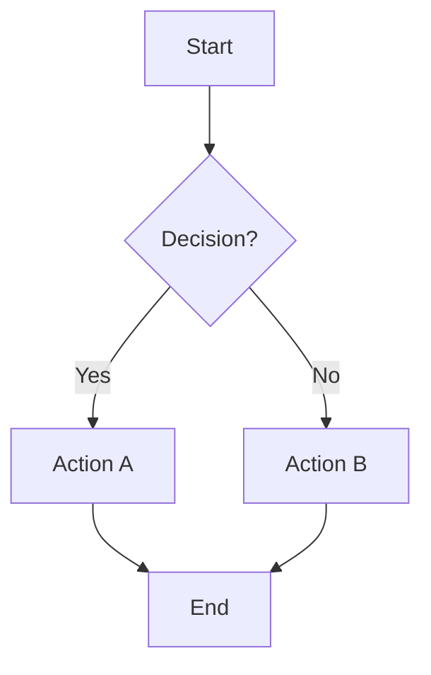
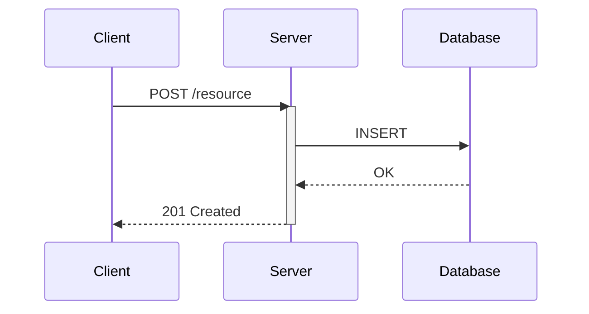
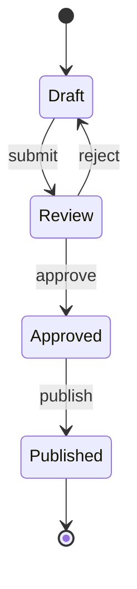
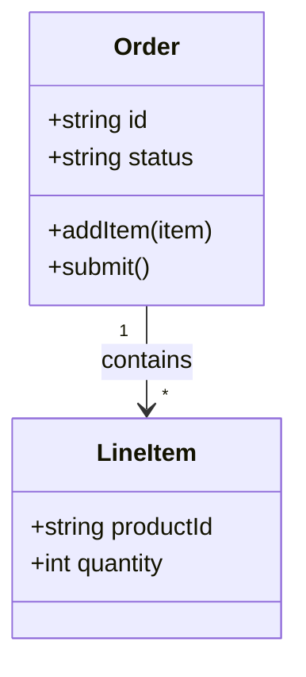
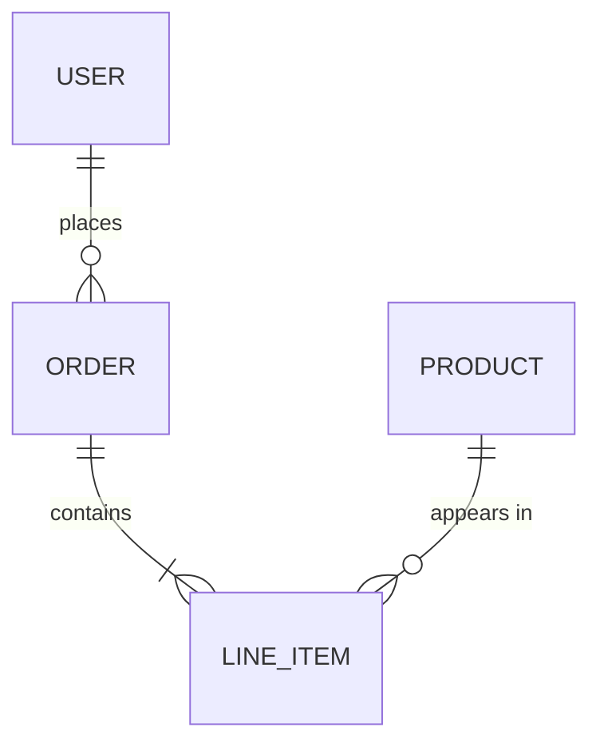

# Mermaid Diagram Conventions

Conventions and copy-paste examples for creating architecture diagrams with Mermaid. All examples render in GitHub, GitLab, and VS Code with Mermaid extensions.

## Diagram Type Selection

| Use Case | Diagram Type | Directive |
|----------|-------------|-----------|
| Process flow, decisions | Flowchart | `flowchart TD` |
| Component interactions over time | Sequence | `sequenceDiagram` |
| Data structures, relationships | Class | `classDiagram` |
| Lifecycle, transitions | State | `stateDiagram-v2` |
| Entity relationships | ER | `erDiagram` |
| C4 architecture | C4 | `C4Context` / `C4Container` |

## Flowchart

**Direction options:** `TD` (top-down), `LR` (left-right), `BT` (bottom-top), `RL` (right-left)

**Node shapes:**
- `[text]` — Rectangle
- `{text}` — Diamond (decision)
- `([text])` — Stadium
- `((text))` — Circle
- `>text]` — Flag

## Sequence Diagram

**Arrow types:**
- `->>` — Solid with arrowhead (request)
- `-->>` — Dashed with arrowhead (response)
- `--)` — Async message

## State Diagram

## Class Diagram

## ER Diagram

## Styling Conventions

- **Label all arrows** — never leave an arrow unlabeled
- **Use participant aliases** — `participant C as Client` is clearer than `participant Client`
- **Keep diagrams under 15 nodes** — split larger diagrams into multiple views
- **Consistent direction** — use `TD` for hierarchies, `LR` for flows
- **Name with nouns** — nodes are things, arrows are actions

## Anti-Patterns
- ❌ Unlabeled arrows between nodes
- ❌ Too many nodes (>15) — split the diagram
- ❌ Mixing abstraction levels in one diagram
- ❌ Using diagram types for the wrong purpose (flowchart for sequence interactions)
- ❌ Platform-specific syntax that doesn't render on GitHub
