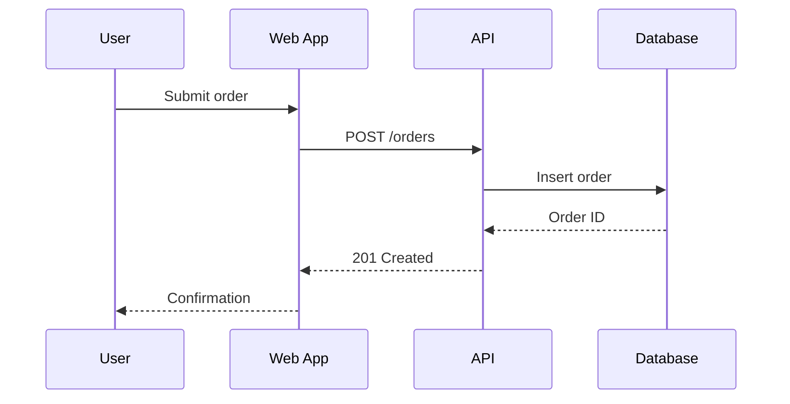

# System Overview Template

A system overview provides a **structured narrative** of the architecture. Inspired by arc42, it covers context, constraints, key decisions, building blocks, and runtime behavior in a single document.

## Template

```markdown
# {System Name} — Architecture Overview

## Introduction

### Purpose
{What the system does and why it exists.}

### Stakeholders
| Role | Concern |
|------|---------|
| {Developer} | {Maintainability, testability} |
| {Product} | {Feature velocity, reliability} |
| {Ops} | {Deployment, monitoring, scaling} |

## Constraints

### Technical
- {e.g., "Must run on Kubernetes"}
- {e.g., "PostgreSQL for relational data (org standard)"}

### Organizational
- {e.g., "Team of 4, no dedicated ops"}
- {e.g., "Must integrate with corporate SSO"}

### Conventions
- {e.g., "REST for sync, events for async"}
- {e.g., "All services deployed as Docker containers"}

## Context

{System context — who uses it, what it depends on. Reference or embed a C4 context diagram.}

See: [Context Diagram](./c4-context.md) or embed inline.

## Building Blocks

### Level 1: Containers

{High-level containers. Reference or embed a C4 container diagram.}

See: [Container Diagram](./c4-container.md) or embed inline.

### Level 2: Key Components

| Component | Responsibility | Location |
|-----------|---------------|----------|
| {Auth Service} | {Authentication and authorization} | `src/auth/` |
| {Order Engine} | {Order lifecycle management} | `src/orders/` |
| {Event Bus} | {Async communication between services} | `src/events/` |

## Runtime Behavior

### {Key Scenario 1: e.g., User Places Order}



### {Key Scenario 2}

{Another important runtime flow.}

## Cross-Cutting Concerns

### Security
- {Authentication approach}
- {Authorization model}

### Observability
- {Logging strategy}
- {Metrics and monitoring}

### Error Handling
- {Error propagation pattern}
- {Retry and circuit breaker strategy}

## Key Decisions

| Decision | Choice | Rationale | See Also |
|----------|--------|-----------|----------|
| {API style} | {REST} | {Team familiarity, tooling} | {ADR link} |
| {Database} | {PostgreSQL} | {ACID, org standard} | {ADR link} |

## Glossary

| Term | Definition |
|------|-----------|
| {Domain Term} | {What it means in this system} |
```

## Guidance
- Start with constraints — they explain WHY the architecture looks the way it does
- Building blocks should map to actual code locations (`src/auth/`, not abstract concepts)
- Include 2-3 key runtime scenarios that show how components interact
- Link to ADRs for detailed decision rationale
- Keep under 300 lines — this is an overview, not exhaustive documentation

## Anti-Patterns
- ❌ Abstract building blocks with no code mapping
- ❌ Missing constraints (makes decisions seem arbitrary)
- ❌ No runtime scenarios (static structure without behavior)
- ❌ Exhaustive detail that belongs in component-level docs
