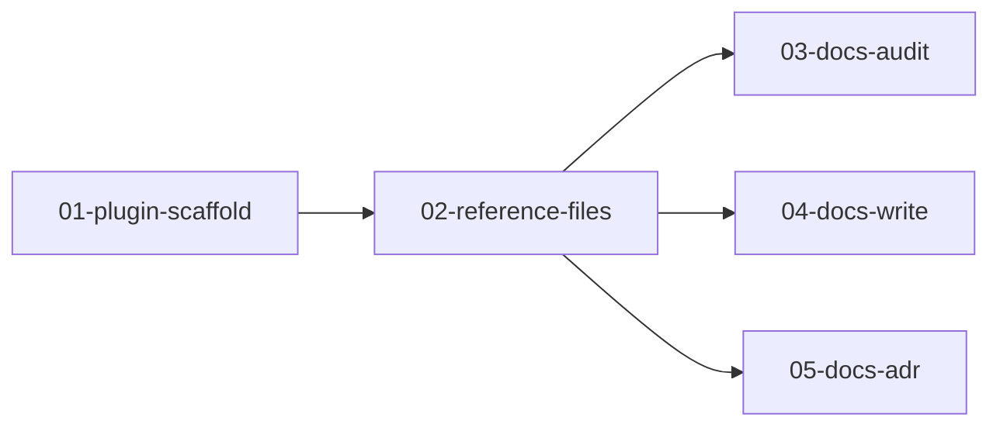

# Plan: Documentation Skills Suite

> Implementation plan for a suite of 3 documentation skills (`docs:audit`, `docs:write`, `docs:adr`) as a separate Claude Code plugin. See [design document](../../designs/documentation-skills/design.md) for problem statement and architectural decisions.

## Summary

Build a self-contained Claude Code plugin named `docs` containing three skills that follow the documentation lifecycle: audit existing docs, write new/updated docs, and record architectural decisions. Each skill uses progressive disclosure with bundled reference files and follows established skill authoring patterns (frontmatter triggers, phased workflows, self-review).

## Architecture Overview

The plugin is a standalone repo/directory with its own `plugin.json`. Each skill is a directory under `skills/` containing a `SKILL.md` and optional `references/` folder. Reference files are markdown templates loaded on demand by Claude to inform content generation.

```
docs-skills/
├── .claude-plugin/
│   └── plugin.json              # name: "docs", version: "1.0.0"
├── skills/
│   ├── audit/                   # → docs:audit
│   │   ├── SKILL.md
│   │   └── references/
│   │       └── quality-criteria.md
│   ├── write/                   # → docs:write
│   │   ├── SKILL.md
│   │   └── references/
│   │       ├── diataxis/        # 4 templates
│   │       ├── ai-files/        # 3 templates
│   │       ├── architecture/    # 4 templates
│   │       └── project/         # 3 templates
│   └── adr/                     # → docs:adr
│       ├── SKILL.md
│       └── references/
│           └── adr/             # 3 MADR variants
└── templates/
    └── CLAUDE.md
```

## Task Breakdown

| # | Component | Sub-Plan | Description |
|---|-----------|----------|-------------|
| 1 | Plugin scaffold | [01-plugin-scaffold.md](01-plugin-scaffold.md) | Create plugin.json, directory structure, CLAUDE.md template |
| 2 | Reference files | [02-reference-files.md](02-reference-files.md) | All 18 reference templates across all 3 skills |
| 3 | docs:audit | [03-docs-audit.md](03-docs-audit.md) | Audit SKILL.md with phased workflow for doc health analysis |
| 4 | docs:write | [04-docs-write.md](04-docs-write.md) | Write SKILL.md with template routing and idempotent updates |
| 5 | docs:adr | [05-docs-adr.md](05-docs-adr.md) | ADR SKILL.md with MADR workflow and status lifecycle |

## Dependencies



Skills (03, 04, 05) can be implemented in parallel after reference files are complete.

## Success Criteria

- All 3 skills trigger correctly from their frontmatter descriptions
- Each SKILL.md is under 400 lines (well within 500-line limit)
- Reference files load on demand (not always in context)
- `docs:audit` produces structured report with Diataxis gap analysis
- `docs:write` routes to correct template for any documentation type
- `docs:adr` generates sequential MADR-formatted ADRs
- Plugin packages successfully via skill-creator's `package_skill.py`

## Verification

- [ ] Plugin structure validates (plugin.json, directory layout)
- [ ] Each SKILL.md has correct frontmatter (name, description, argument-hint)
- [ ] Reference files are well-structured markdown with clear sections
- [ ] Skills follow established patterns (Core Principles, Trigger Conditions, Phases, Quality Standards, Anti-Patterns, Exit Signals)
- [ ] Total per-invocation context stays within ~600-800 lines budget

## References

- Design: [design.md](../../designs/documentation-skills/design.md)
- Existing skill patterns: `skills/brainstorm/SKILL.md`, `skills/diagnose/SKILL.md`
- Skill-creator best practices: progressive disclosure, references/ classification, frontmatter triggers

## Self-Review Log

### Round 1
**Issues Found:** 2
- [Documentation/Completeness] `templates/CLAUDE.md` purpose mischaracterized as docs:write asset → Clarified as plugin development guide, distinct from `references/ai-files/claude-md.md`
- [Completeness] `04-docs-write` missing Phase 0 prerequisites → Added Phase 0 task with project root resolution and existing doc detection

### Round 2 (fresh read)
**Issues Found:** 0
- All themes pass ✅

### Round 3 (fresh read)
**Issues Found:** 0
- All themes pass ✅

---
*Plan created: 2026-01-27*
*Components: 5 sub-plans*
