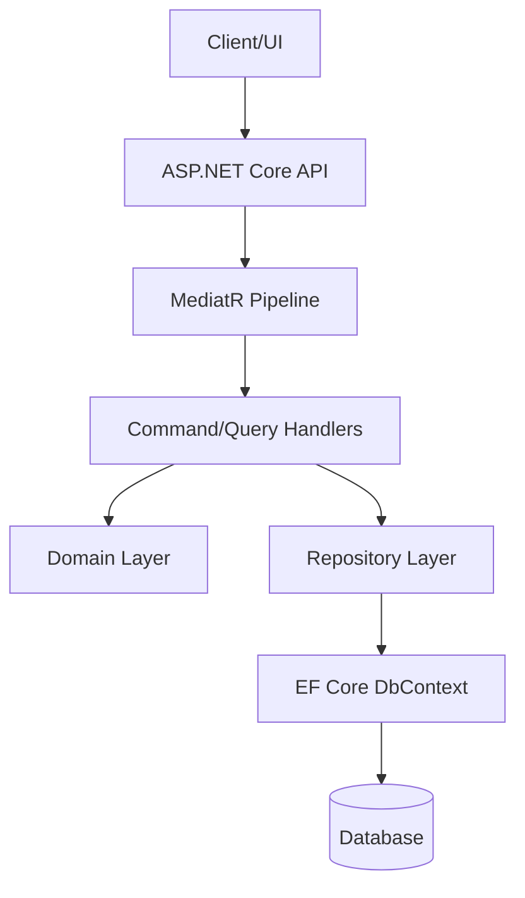
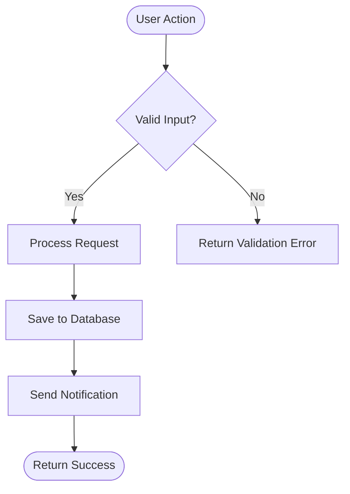
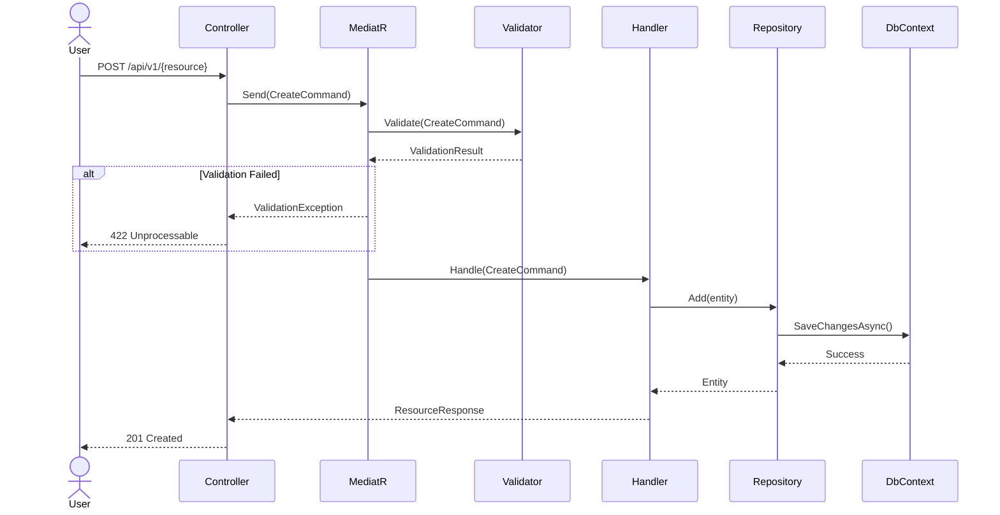
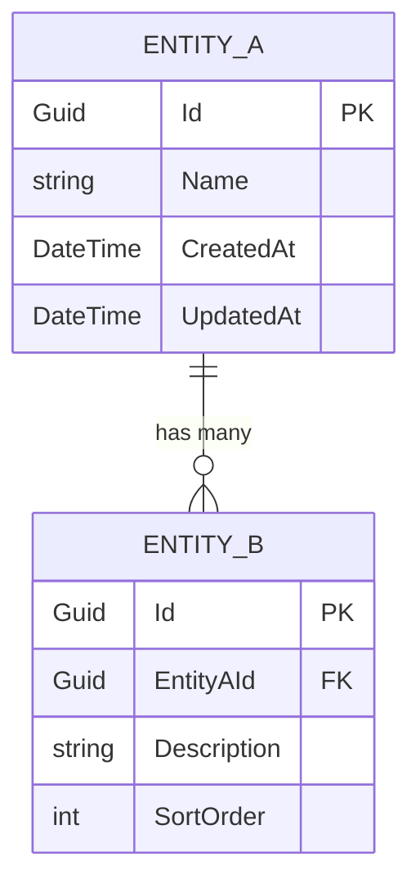
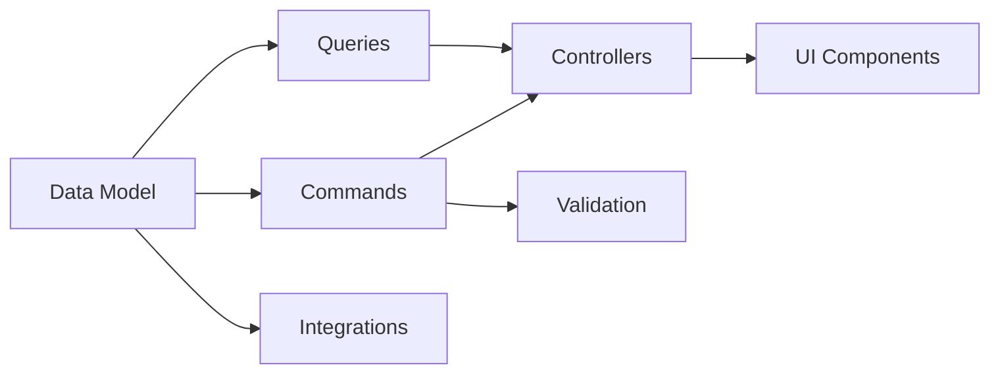

# Technical Design: Requirements → Architecture & Specifications

**Philosophy:** A technical design bridges the "what" (PRD) to the "how" (implementation plan). Every diagram, endpoint, and entity definition here removes ambiguity that would otherwise slow down execution. Design once, implement confidently.

## Core Principles

1. **Diagram-driven** — Architecture, sequences, ERDs, and flows in Mermaid
2. **Pattern-consistent** — Follow existing codebase patterns, don't invent new ones
3. **CQRS-native** — Commands and queries separated throughout
4. **Specification-complete** — Endpoints, DTOs, mappers, validation rules defined
5. **Testability-first** — Every component designed for unit testing

---

## Trigger Conditions

Run this skill when:
- After PRD approval (business features)
- After brainstorm (technical improvements)
- User needs architecture, API specs, or data models
- User says "design the API", "what's the architecture", "create technical spec"
- Before /plan for any medium-to-large change

---

## Persistent Context Files

```
${PROJECT_ROOT}/docs/designs/{feature}/
├── design.md          # Overview + links to sub-documents
├── architecture.md    # System design, component diagram
├── sequences.md       # Sequence diagrams for key flows
├── data-model.md      # ERD, entity definitions, migrations
├── api-spec.md        # Endpoints, DTOs, commands, queries
├── ui-wireframes.md   # UI mockups (optional)
├── integrations.md    # External APIs, importers (optional)
├── findings.md        # Working notes (persistent context)
└── progress.md        # Phase completion tracking
```

---

## Critical Sequence

### Phase 0: Prerequisites

```bash
PROJECT_ROOT=$(git rev-parse --show-toplevel)
mkdir -p "${PROJECT_ROOT}/docs/designs/{feature}"
```

**Import upstream artifacts:**
```bash
# Check for PRD
ls "${PROJECT_ROOT}/docs/prd/{feature}/"

# Check for brainstorm
ls "${PROJECT_ROOT}/docs/brainstorm/{feature}/"

# Check for research
ls "${PROJECT_ROOT}/docs/research/{feature}/"

# Check existing architecture docs
ls "${PROJECT_ROOT}/docs/architecture/"

# Check learnings
ls "${PROJECT_ROOT}/docs/learnings/"
```

Import: functional requirements, use cases, personas, boundaries, and chosen approach from upstream documents. These constrain the design.

Initialize `progress.md`:
```markdown
# Technical Design Progress: {Feature}
- [ ] Phase 1: Architecture Overview
- [ ] Phase 2: Process Flows
- [ ] Phase 3: Sequence Diagrams
- [ ] Phase 4: Data Model & ERD
- [ ] Phase 5: API Specification
- [ ] Phase 6: UI Wireframes
- [ ] Phase 7: Integration Patterns
- [ ] Phase 8: Work Decomposition
- [ ] Phase 9: Self-Review & Approval
```

---

### Phase 1: Architecture Overview

**Step 1.1 — System Component Diagram:**

Create a Mermaid component diagram showing how the feature fits into the existing system:



**Step 1.2 — Layer Structure:**

| Layer | Responsibility | .NET Pattern |
|-------|---------------|-------------|
| API | Controllers, request validation | ASP.NET Core Controllers |
| Application | Commands, queries, handlers | MediatR IRequest/IRequestHandler |
| Domain | Entities, value objects, rules | Plain C# classes |
| Infrastructure | Data access, external services | EF Core, HttpClient |

**Step 1.3 — Technology Decisions:**
- Framework version and key libraries
- New NuGet packages needed (if any)
- Cross-cutting concerns (logging, auth, error handling patterns)
- Deployment considerations

Write to `architecture.md`.

---

### Phase 2: Process Flow Diagrams

For each key use case from the PRD, create a flowchart:



Map each flow to its use case ID (UC-001, UC-002...).

Include:
- Happy path (main flow)
- Decision points and branches
- Error/exception paths
- External system interactions

---

### Phase 3: Sequence Diagrams

For each critical interaction, create a Mermaid sequence diagram showing the full request lifecycle:



Create sequences for:
- Each command (create, update, delete) showing CQRS flow
- Each query showing read path
- Authentication flows (if applicable)
- Background job triggers (if applicable)

Write to `sequences.md`.

---

### Phase 4: Data Model & ERD

**Step 4.1 — Entity-Relationship Diagram:**



**Step 4.2 — Entity Definitions:**

For each entity, document:
- Properties with types and constraints
- Relationships (navigation properties)
- EF Core configuration notes (indexes, unique constraints)
- Soft delete strategy (if applicable)

**Step 4.3 — Migration Strategy:**
- New tables needed
- Columns added to existing tables
- Data migration requirements
- Seed data needs
- Rollback approach

Write to `data-model.md`.

---

### Phase 5: API Specification

This is the most detailed phase. For detailed templates and patterns, read `references/dotnet-patterns.md`.

**For each endpoint, specify:**

```markdown
### POST /api/v1/{resource}
**Maps to:** FR-001, UC-001
**Auth:** [Authorize(Policy = "RequiredPolicy")]

**Command:** Create{Resource}Command
**Handler:** Create{Resource}CommandHandler

**Request DTO:**
```csharp
public record Create{Resource}Request(
    string Name,
    string Description,
    Guid? ParentId
);
```

**Validation (FluentValidation):**
```csharp
RuleFor(x => x.Name).NotEmpty().MaximumLength(200);
RuleFor(x => x.Description).MaximumLength(2000);
```

**Response DTO:**
```csharp
public record {Resource}Response(
    Guid Id,
    string Name,
    string Description,
    DateTime CreatedAt
);
```

**Mapper (AutoMapper):**
```csharp
CreateMap<{Resource}Entity, {Resource}Response>();
```

**Entity Mapper (in handler):**
```csharp
var entity = new {Resource}Entity
{
    Name = command.Name,
    Description = command.Description
};
```

**Error Responses:** 400, 401, 403, 404, 409, 422
```

**Organize by:**
1. Commands (POST, PUT, PATCH, DELETE) with MediatR handlers
2. Queries (GET) with MediatR handlers
3. Shared DTOs and mappers

Write to `api-spec.md`.

---

### Phase 6: UI Wireframes (Optional)

Create ASCII mockups for key screens:

```
┌─────────────────────────────────┐
│ Feature Name            [Save]  │
├─────────────────────────────────┤
│ Name: [________________]        │
│ Description:                    │
│ [______________________________]│
│ [______________________________]│
│                                 │
│ Category: [Dropdown ▼]          │
│                                 │
│ [Cancel]              [Submit]  │
└─────────────────────────────────┘
```

For each screen:
- Component hierarchy
- Form fields mapped to API endpoint/DTO
- Validation rules (client + server)
- User actions mapped to API calls

Write to `ui-wireframes.md`.

---

### Phase 7: Integration Patterns (If Applicable)

**Excel Import Pattern:**
```markdown
### Excel Import: {Feature}
**File format:** .xlsx with columns [A, B, C, ...]
**Validation:** Row-level (type, required) + batch-level (duplicates, references)
**Import flow:**
1. Upload → Parse with EPPlus/ClosedXML
2. Validate → Collect row errors, don't fail batch
3. Preview → Show valid/invalid counts
4. Confirm → User approves
5. Process → MediatR command per batch (not per row)

**Error handling:** Row errors accumulated, valid rows processed, error report returned
**Pattern:** ImportCommand → ImportHandler → ValidationService → BulkRepository
```

**External API Integration:**
- Auth mechanism (API key, OAuth, JWT)
- Rate limiting strategy
- Retry/fallback logic (Polly)
- Circuit breaker pattern

**Background Jobs:**
- Job trigger (schedule, event, manual)
- Pattern (IHostedService, Hangfire)
- Idempotency approach

Write to `integrations.md`.

---

### Phase 8: Work Decomposition Preview

This connects the design to the /plan skill:

```markdown
## Work Decomposition

### Component Breakdown
| Component | Scope | Complexity | Risk |
|-----------|-------|------------|------|
| Data Model | Entities, migrations, EF config | M | Low |
| Commands | Create/Update/Delete handlers | L | Medium |
| Queries | List/Get handlers | S | Low |
| API Controllers | Endpoints, auth policies | M | Low |
| Validation | FluentValidation rules | S | Low |
| UI Components | Forms, lists, detail views | L | Medium |
| Integrations | Excel import, external APIs | XL | High |

### Dependency Graph


### Suggested Execution Order
1. Data Model — foundation, everything depends on this
2. Commands + Validation — write path
3. Queries — read path
4. API Controllers — expose to clients
5. UI Components — consume the API
6. Integrations — Excel import, external APIs
```

---

### Phase 9: Self-Review & Approval

**2 rounds minimum, exit on 2 consecutive clean rounds.**

**7 Review Themes:**

1. **Architecture Soundness** — Follows layer structure? Consistent with existing patterns?
2. **API Completeness** — Every FR has an endpoint? Request/response DTOs defined?
3. **Data Model Integrity** — ERD matches API needs? Relationships correct? Migrations safe?
4. **Diagram Accuracy** — Sequences match endpoints? Flows match use cases?
5. **Pattern Consistency** — CQRS respected? AutoMapper used correctly? Validation in right layer?
6. **Testability** — Every handler unit-testable? Dependencies injectable?
7. **Traceability** — Every endpoint maps to FR? Every FR maps to use case?

**Review Log:**
```markdown
### Round 1
**Issues:** {count}
- [{theme}] {issue} → Fix: {fix}

### Round 2
**Issues:** 0 ✅
```

---

### Present to User

```markdown
## Technical Design Complete

**Feature:** {name}
**Architecture docs:** {count} files
**Endpoints defined:** {count}
**Entities defined:** {count}
**Diagrams created:** {count}

Saved to: `docs/designs/{feature}/`

Ready for review:
1. "design approved" → Proceed to /plan
2. "refine" → Continue iterating
3. "park" / "abandon"
```

---

## Exit Signals

| Signal | Meaning |
|--------|--------|
| "design approved" | Proceed to /plan |
| "refine" | Continue iterating |
| "park" | Save for later |
| "abandon" | Don't build this |

When approved: **"Design approved. Run /plan to create implementation plan."**

---

## Reference Files

For detailed .NET/C# patterns and templates, read `references/dotnet-patterns.md`.
